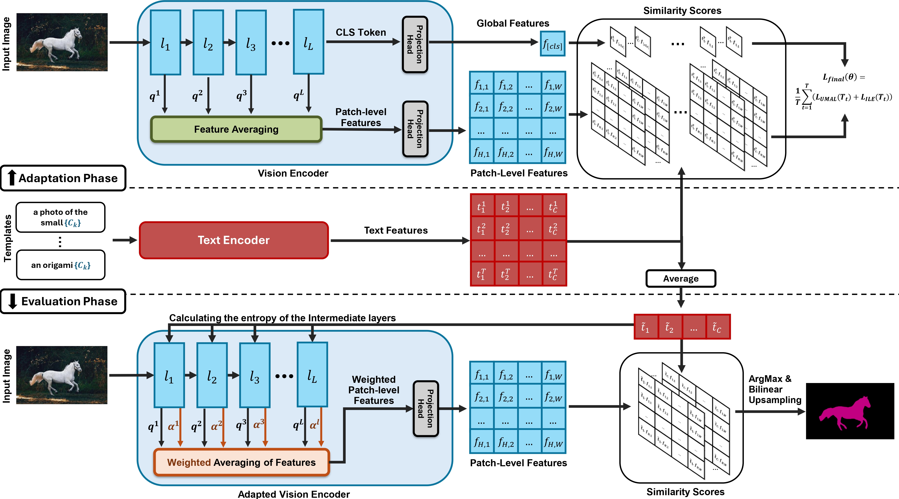

# [NeurIPS 2025] Test-Time Adaptation of Vision-Language Models for Open-Vocabulary Semantic Segmentation

The official implementation of our paper "Test-Time Adaptation of Vision-Language Models for Open-Vocabulary Semantic Segmentation".

## Method


<p align="justify">
<b>Abstract:</b> Recently, test-time adaptation has attracted wide interest in the context of vision-language models for image classification. However, to the best of our knowledge, the problem is completely overlooked in dense prediction tasks such as Open-Vocabulary Semantic Segmentation (OVSS). In response, we propose a novel TTA method tailored to adapting VLMs for segmentation during test time. Unlike TTA methods for image classification, our Multi-Level and Multi-Prompt (MLMP) entropy minimization integrates features from intermediate vision-encoder layers and is performed with different text-prompt templates at both the global CLS token and local pixel-wise levels. Our approach could be used as plug-and-play for any segmentation network, does not require additional training data or labels, and remains effective even with a single test sample. Furthermore, we introduce a comprehensive OVSS TTA benchmark suite, which integrates a rigorous evaluation protocol, seven segmentation datasets, and 15 common corruptions, with a total of 82 distinct test scenarios, establishing a standardized and comprehensive testbed for future TTA research in open-vocabulary segmentation.
</p>

<p align="center">
    
</p>

<!-- Add space -->
<div style="margin-bottom: 15px;"></div>

* **Plug-and-Play TTA Framework for OVSS:**  We introduce MLMP, which is, to the best of our knowledge, the first fully test-time adaptation method that could be easily applied to any OVSS backbone.

* **Adaptive Multi-Level Fusion:** MLMP integrates features from intermediate vision-encoder layers to capture complementary, shift-resilient cues. To further enhance robustness, we propose an uncertainty-aware strategy that re-weights features from individual layers based on their prediction entropy.

* **Multi-Prompt Local-Global Test Time Optimization:** MLMP turns prompt sensitivity into signal by directly minimizing entropy across different text prompt templates at both the global CLS token and local pixel-wise levels. This optimization naturally complements our mutli-layer feature fusion by enforcing consistency across linguistic perspectives and feature depths.

* **Comprehensive OVSS TTA Benchmark Suite:** We curate a rigorous evaluation protocol spanning seven mainstream segmentation datasets and 15 common corruptions, **with a total of 82 distinct test scenarios**, establishing a standardized and comprehensive testbed for future TTA research in open-vocabulary segmentation. Our experiments on this suite demonstrate that MLMP consistently delivers significant gains over baselines across all scenarios.


## Requirements 
- [Python 3.10.13](https://www.python.org/)
- [CUDA 11.8](https://developer.nvidia.com/cuda-zone)
- [PyTorch 2.1.2](https://pytorch.org/)
- [MMSegmentation 1.2.2](https://github.com/open-mmlab/mmsegmentation)


## Getting Started
### Step 1: Requirements
To run MLMP, please install the following packages, and conda environment:

```bash
conda create -n mlmp python==3.10.13
conda activate mlmp
pip install torch==2.1.2 torchvision==0.16.2 torchaudio==2.1.2 --index-url https://download.pytorch.org/whl/cu118
pip install -r requirements.txt
```

---
### Step 2: Prepare Datasets

We evaluate MLMP on seven widely-used segmentation benchmarks, chosen to span indoor/outdoor scenes, object–stuff mixes, and a range of class granularities:

- [PASCAL VOC 20/21](https://paperswithcode.com/dataset/pascal-voc) – The 20 foreground categories (with an optional challenging background label).
- [PASCAL Context 59/60](https://paperswithcode.com/paper/the-role-of-context-for-object-detection-and) – The 59 foreground categories (with an optional challenging background label).
- [CityScapes](https://www.cityscapes-dataset.com/) – 19 urban-scene categories.
- [COCO-Object](https://arxiv.org/abs/1405.0312) – the 80 COCO object classes.
- [COCO-Stuff 164k](https://arxiv.org/abs/1612.03716) – 164 thing-and-stuff classes.


Please follow the [MMSeg data preparation document](https://github.com/open-mmlab/mmsegmentation/blob/main/docs/en/user_guides/2_dataset_prepare.md) to download and pre-process the datasets. Please note that we only use the validation split of each dataset.


Additionally, inspired by [ImageNet-C](https://github.com/hendrycks/robustness), we generate 15 corruption types (e.g., noise, blur, weather, compression) *on-the-fly* at test time, allowing us to effectively evaluate each adaptation method’s robustness to diverse distribution shifts. 

Remember to modify the dataset paths `DATA_DIR` and corruption type in the bash files in `./bash`. 

---
### Step 3: Perform Adaptation

There are different bash files in `./bash` directory which are prepared to reproduce the results of the paper for **different methods**, **datasets**, and **corruptions**.

We support these methods:
- MLMP (our proposed method)
- [WATT](https://arxiv.org/abs/2406.13875)
- [CLIPArTT](https://arxiv.org/abs/2405.00754)
- [TPT](https://arxiv.org/abs/2209.07511)
- [TENT](https://arxiv.org/abs/2006.10726)

To reproduce our results on PASCAL VOC 20 (v20)— the clean split and all 15 corruption variants—simply run `./bash/v20/mlmp.sh`:
```bash
# GPU Configuration
GPU_ID=0

# Dataset Configuration
DATASET=PascalVOC20Dataset
DATA_DIR=".data/VOC2012/"
INIT_RESIZE="224 224"
ALL_CORRUPTIONS="original gaussian_noise shot_noise impulse_noise defocus_blur glass_blur motion_blur zoom_blur snow frost fog brightness contrast elastic_transform pixelate jpeg_compression"
WORKERS=4

# Method and OVSS Model Configuration
METHOD="mlmp"
OUT_VISION="-1 -2 -3 -4 -5 -6 -7 -8 -9 -10 -11 -12 -13 -14 -15 -16 -17 -18"
PROMPT_DIR="prompts.yaml"
ALPHA_CLS=1.0
OVSS_TYPE="naclip"
OVSS_BACKBONE="ViT-L/14"

# Hyperparameters
BATCH_SIZE=2
LR=0.001
STEPS=10
TRIALS=3

# Output
SAVE_DIR=".save/${DATASET}/${METHOD}/"

# Run
CUDA_VISIBLE_DEVICES=$GPU_ID python main.py --adapt --method $METHOD --prompt_dir $PROMPT_DIR --vision_outputs $OUT_VISION --alpha_cls $ALPHA_CLS --ovss_type $OVSS_TYPE --ovss_backbone $OVSS_BACKBONE --save_dir $SAVE_DIR --data_dir $DATA_DIR --dataset $DATASET --workers $WORKERS --init_resize $INIT_RESIZE --patch_size 224 224 --patch_stride 112 --corruptions_list $ALL_CORRUPTIONS --lr $LR --steps $STEPS --batch-size $BATCH_SIZE --trials $TRIALS --seed 0 --plot_loss --class_extensions

```

## Results

Here are the results of our proposed MLMP on V20 dataset. For a more detailed analysis and a complete table of the results, please refer to our paper.

| Corruption           | NoAdapt. |  TENT  |  TPT   |  WATT  | CLIPArTT |  MLMP   |
|----------------------|----------|--------|--------|--------|----------|---------|
| Original             | 75.91    | 77     | 75.93  | 57.73  | 72.77    | **83.76** |
| Gaussian Noise       | 62.89    | 63.02  | 62.98  | 36.44  | 53.36    | **71.13** |
| Shot Noise           | 66.26    | 65.88  | 66.33  | 40.95  | 58.15    | **75.02** |
| Impulse Noise        | 63.16    | 64.17  | 63.12  | 34.90  | 54.83    | **71.34** |
| Defocus Blur         | 72.59    | 72.06  | 72.55  | 52.43  | 65.39    | **80.36** |
| Glass Blur           | 71.44    | 70.74  | 71.40  | 49.96  | 64.62    | **78.84** |
| Motion Blur          | 73.10    | 73.50  | 73.16  | 53.35  | 67.48    | **81.41** |
| Zoom Blur            | 59.03    | 61.36  | 59.00  | 41.39  | 52.37    | **69.41** |
| Snow                 | 71.49    | 71.04  | 71.44  | 51.18  | 66.97    | **79.53** |
| Frost                | 65.38    | 67.01  | 65.46  | 45.75  | 60.48    | **73.20** |
| Fog                  | 70.69    | 70.54  | 70.70  | 52.96  | 67.85    | **79.81** |
| Brightness           | 74.95    | 75.61  | 74.95  | 55.82  | 71.52    | **83.51** |
| Contrast             | 71.51    | 70.51  | 71.49  | 50.74  | 66.01    | **79.06** |
| Elastic Transform    | 62.86    | 65.78  | 62.95  | 45.45  | 60.41    | **74.03** |
| Pixelate             | 77.28    | 76.95  | 77.31  | 59.76  | 73.14    | **84.97** |
| JPEG Compression     | 72.59    | 71.84  | 72.56  | 53.44  | 68.21    | **82.06** |
| V20-C (Average)      | 69.01    | 69.33  | 69.03  | 48.30  | 63.39    | **77.58** |


## License

This source code is released under the MIT license, which can be found [here](LICENCE). This project integrates elements from the following repositories; we gratefully acknowledge the authors for making their work open-source:
- [WATT](https://github.com/mehrdad-noori/watt) (MIT licensed)
- [NACLIP](https://github.com/sinahmr/NACLIP) (MIT licensed)
- [CLIP](https://github.com/openai/CLIP/tree/main/clip) (MIT licensed)
- [TENT](https://github.com/DequanWang/tent) (MIT licensed)
